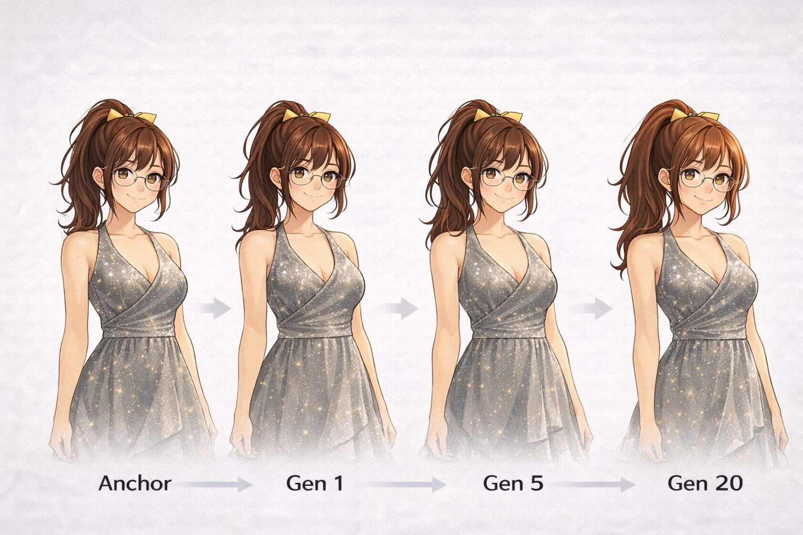

# Character Consistency QA Pipeline

> Generation does not stabilize identity.  
> It amplifies drift.

Consistent characters accelerate production.

---

## Problem

In IP-based production, character consistency is critical.

Even small deviations can:

- Break continuity across scenes  
- Damage brand integrity  
- Increase manual correction and rework  
- Slow down production workflows  

AI-generated images often introduce subtle inconsistencies,  
even with the same prompt and setup.

> More generations do not stabilize identity.  
> They amplify drift and increase risk.

---

## Anchor Definition

  
  

Character identity must be defined before it can be validated.

The anchor represents the reference identity:

- Face structure  
- Hair shape and volume  
- Body proportions  
- Key visual features  

Consistency is not similarity.  
It is distance from the anchor.

→ No anchor = No identity

## Example

Same prompt. Same setup.

### Valid (PASS)
Valid Character

### Invalid (FAIL)
Invalid Character

Looks similar.  
But not the same character.

→ Cannot be used in production.

---

## Root Cause

This is not a prompt failure.

Generative systems do not execute input directly:

A → (A + C) → A′ → B′

- The input is internally restructured (A′)  
- Small variations in A′ lead to identity drift  

→ Even identical prompts can produce different characters

---

## Cumulative Identity Drift

  

Even when each generated image appears correct, identity drift accumulates across generations.

This is not a time-based issue.  
It is a generation-based phenomenon.

> Each generation introduces a small deviation.

---

### Core Principle

> The more you generate, the more you drift.

---

### Identity Collapse

Small deviations per image accumulate over repeated generations.

→ Eventually, the character is no longer the same identity.

---

### Critical Insight

High per-image similarity does not guarantee identity consistency.

> Consistency per image ≠ Consistency across generations

---

### Operational Reality

> Generating more does not stabilize identity.  
> It increases both cost and divergence.

---

## Mindset

Consistency is not a generation problem.  
It is a validation problem.

If the character drifts, it is not usable.

---

## Validation Pipeline

  

If it fails, it is not fixed.  
It is rejected.

This is a governance decision.

---

## Workflow

Instead of trying to generate the perfect image,  
treat generation as a search process.

1. Generate candidates  
2. Validate identity  
3. Reject inconsistent outputs  

→ If the character deviates, discard it.

---

## Important Clarification

Discarding is not a workaround.

It is a governance decision.

- Inconsistent outputs are not “almost correct”  
- They are invalid states

---

## Recovery Loop

Character consistency is achieved through repetition:

1. Generate  
2. Validate  
3. Reject  
4. Regenerate  

→ Identity is not generated  
→ It is recovered

---

## Traceability (Audit Layer)

Each generation cycle can be logged:

- Input prompt (A)  
- Internal transformation (A′)  
- Generated output (B′)  
- Validation result (PASS / FAIL)  

→ Identity becomes traceable and explainable

---

## Result

- Stable character identity  
- Reduced rework  
- Consistent workflow  
- No model modification required  

---

## Business Value

- Lower production cost  
- Reduced correction workload  
- Consistent brand output  
- Scalable production pipeline  

---

## Why This Matters

> More generations do not solve the problem.

They make it worse.

- Cost increases  
- Identity diverges  
- Consistency collapses  

---

## Positioning

This is not a prompt technique.  
This is not a model improvement.

This is a quality control and identity recovery system.

---

## Summary

- If it drifts, discard it  
- Drift accumulates across generations  
- Identity collapses beyond a threshold  
- Consistency is achieved through validation  

---

## Contact

For business inquiries, open an Issue using the template.

---

## License

MIT License
