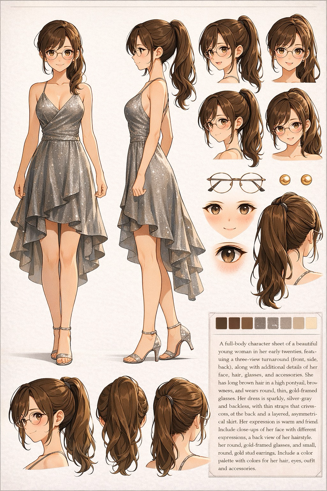
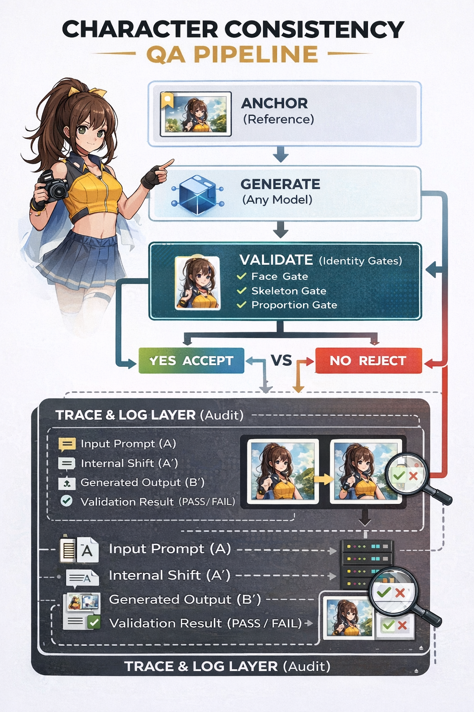

# Character Consistency QA Pipeline

Consistent characters accelerate production.

---

## Problem

In IP-based production, character consistency is critical.

Even small deviations can:

- Break continuity across scenes  
- Damage brand integrity  
- Increase manual correction and rework  
- Slow down production workflows  

AI-generated images often introduce subtle inconsistencies,
even with the same prompt and setup.

---

## Example

Same prompt. Same setup.

### Valid (PASS)

### Invalid (FAIL)

Looks similar.  
But not the same character.

→ Cannot be used in production.

---

## Root Cause

This is not a prompt failure.

Generative systems do not execute input directly:

A → (A + C) → A′ → B′

- The input is internally restructured (A′)  
- Small variations in A′ lead to identity drift  

→ Even identical prompts can produce different characters

---

## Mindset

Consistency is not a generation problem.  
It is a validation problem.

**If the character drifts, it is not usable.**

---

## Validation Pipeline

Consistency is not a generation problem.  
It is a validation problem.

Below is the operational structure of the QA pipeline:

  

If it fails, it is not fixed.  
It is rejected.

This pipeline treats every generated output as a candidate, not a final result.

Only outputs that pass all identity gates are accepted.  
All others are rejected.

---

## Workflow

Instead of trying to generate the perfect image,  
treat generation as a search process.

1. Generate candidates  
2. Validate identity  
3. Reject inconsistent outputs  

Simple rule:

→ If the character deviates, discard it.

---

## Important Clarification

Discarding is not a workaround.

It is a **governance decision**.

- Inconsistent outputs are not “almost correct”  
- They are **invalid states**

→ The system must explicitly reject them

---

## Recovery Loop

Character consistency is achieved through repetition:

1. Generate  
2. Validate  
3. Reject (if needed)  
4. Regenerate  

This forms a **controlled convergence loop**

→ Identity is not generated  
→ It is **recovered through iteration**

---

## Traceability (Audit Layer)

In production environments, validation alone is not sufficient.

Each generation cycle can be logged and analyzed:

- Input prompt (A)  
- Internal transformation (A′)  
- Generated output (B′)  
- Validation result (PASS / FAIL)  

This enables:

- Failure pattern analysis  
- Reproducibility of successful outputs  
- Auditability for enterprise workflows  

→ Character identity becomes not only controllable,  
   but also **traceable and explainable**

---

## Result

- Stable character identity across outputs  
- Reduced rework and manual correction  
- Consistent production workflow  
- No additional model changes required  

---

## Business Value

- Reduce reliance on external vendors and lower costs  
- Maintain full control over character quality in-house  
- Eliminate dependency on individual expertise  
- Enable stable and repeatable production  

---

## How to Use

1. Generate multiple candidates  
2. Check character consistency  
3. Discard inconsistent outputs  
4. Keep only valid results  

Repeat until stable outputs are obtained.

---

## Why This Works

Most approaches try to improve generation quality.

However, in production:

→ Even small inconsistencies create real cost  
→ Inconsistent outputs cannot be used  

This workflow shifts the focus:

**From generation → to validation → to recovery**

---

## Positioning

This is not a prompt technique.  
This is not a model change.

This is a **quality control and recovery layer for character identity**.

---

## Summary

- Simple rule: **If it drifts, discard it**  
- Drift is caused by internal reconstruction (A′)  
- Consistency is achieved through validation loops  
- Identity is recovered, not generated  

---

## Contact

For business inquiries, please open an Issue using the "Business Inquiry" template.

---

## License

MIT License. See LICENSE file for details.
